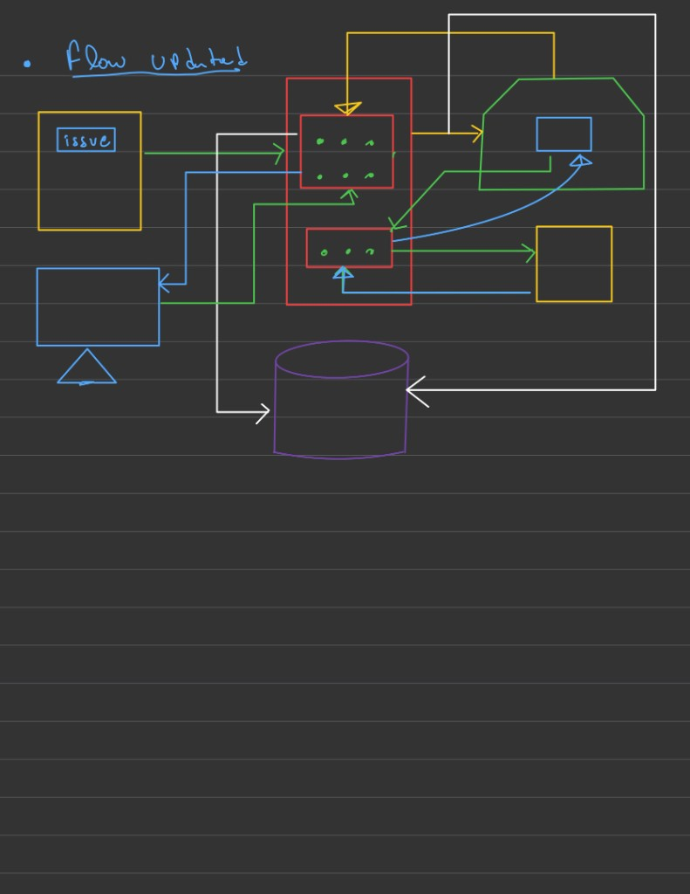
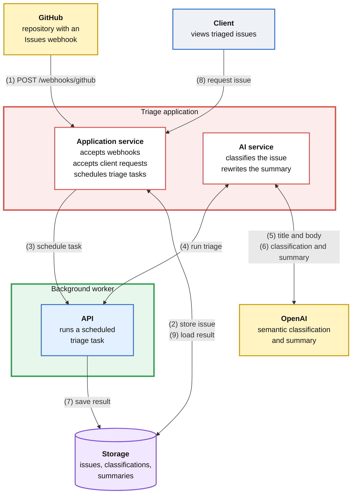
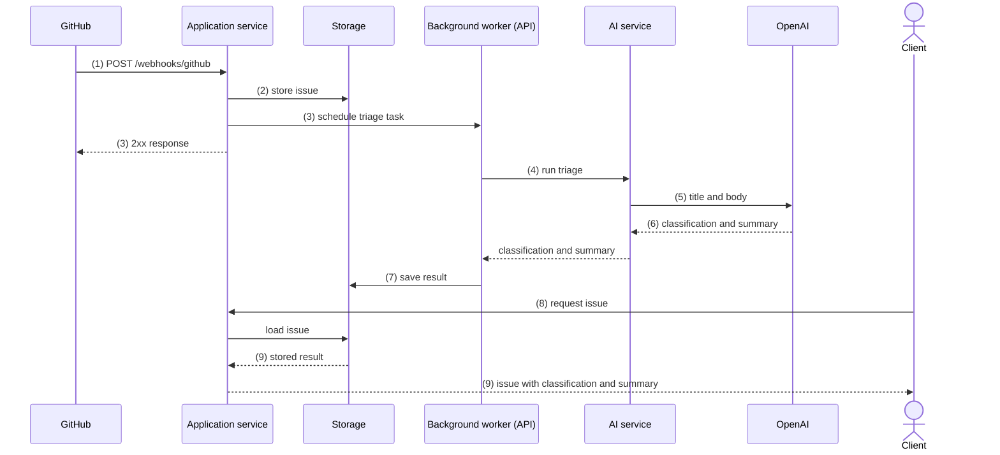

# IssueTriage

IssueTriage watches a GitHub repository and triages each new issue. OpenAI reads the issue and returns two things: a semantic classification, and a summary that is clearer than the original report.

GitHub delivers the issue. The application exposes one HTTP endpoint and waits for GitHub to call it.

## Architecture



The sketch above is the system. Color marks the role of each part.

| Color | Part | Role |
| --- | --- | --- |
| Yellow | External systems | GitHub, the source of issues, and OpenAI, which classifies and summarizes them. |
| Red | Triage application | Two services: the application service and the AI service. |
| Blue | API | HTTP interface the worker uses to run a scheduled triage task. |
| Green | Background worker | Runs triage after the webhook request has been accepted. |
| Purple | Storage | Persists the issue, its classification, and its summary. |

The workstation in the sketch is the client. It asks the application service for triaged issues.

The numbers on the arrows match the steps in [Flow](#flow). A two-way arrow is a request and its response.



### Triage application

The red boundary is one application with two services.

**Application service.** This service owns the edge of the system:

- It accepts the GitHub webhook.
- It accepts requests from the client.
- It schedules a background task for each issue that still needs triage.

**AI service.** Background tasks call this service. It sends the issue title and body to OpenAI and returns a classification together with a rewritten summary. The webhook request ends once the task is scheduled. The OpenAI call runs in the worker.

### Background worker and API

The green boundary is the background worker. The blue box inside it is the API that receives a scheduled task and calls the AI service.

The application service answers GitHub as soon as the issue is stored and the task is scheduled. The worker then calls OpenAI, through the AI service, and writes the classification and summary to storage.

### Storage

The purple cylinder holds the issue as GitHub sent it, plus the triage result. The worker writes the result. The application service reads it when the client asks.

### External systems

Both yellow boxes sit outside the triage application.

- The labeled box is GitHub. An issue event leaves that box and enters the application service.
- The unlabeled box is OpenAI. The AI service sends the issue there and receives the classification and summary.

## Flow

1. Someone opens an issue in the connected repository, and GitHub sends an HTTP `POST` to `/webhooks/github`.
2. The application service verifies the webhook signature and stores the issue.
3. The application service schedules a triage task and responds to GitHub.
4. The background worker picks up the task through its API and calls the AI service.
5. The AI service sends the issue title and body to OpenAI.
6. OpenAI returns a semantic classification and a clearer summary.
7. The worker saves both on the issue in storage.
8. The client requests the issue from the application service.
9. The application service loads the stored classification and summary and returns them to the client.

The same flow in time order. GitHub gets its response at step 3, before any OpenAI call is made.



An incoming payload looks like this:

```json
{
  "action": "opened",
  "issue": {
    "title": "Login is not working",
    "body": "..."
  },
  "repository": {
    "id": 12345,
    "full_name": "yonathan/example-project"
  }
}
```

The `repository` object tells the application which repository produced the event. The endpoint is shared; the payload names the source.

## Webhook

This project uses one repository webhook.

A repository webhook receives events only from that repository. The triage application still needs only one endpoint. Every repository that should be triaged can post to the same URL:

```text
Repository A ─┐
Repository B ─┼── POST /webhooks/github ──► Triage application
Repository C ─┘
```

### Setup for this project

Use one repository that you own.

1. Open **Settings → Webhooks → Add webhook**.
2. Set the payload URL to `https://your-public-address/webhooks/github`.
3. Set the content type to `application/json`.
4. Create a webhook secret. The application service checks the signature before it stores the issue or schedules work.
5. Subscribe only to **Issues** events.
6. Open an issue in that repository.

GitHub then sends one `POST`. The public address has to be reachable from GitHub.

### Later, more than one repository

Three ways to cover more than the single repository. This project stays on the first row until the pipeline above works.

| Option | Coverage | Complexity |
| --- | --- | --- |
| Repository webhook | One repository | Low |
| Organization webhook | Every repository in one organization | Medium |
| GitHub App | Selected repositories, or every repository where the app is installed | High |

Repository webhooks receive events only from their own repository. An organization webhook can receive events from all repositories owned by that organization. A GitHub App has one webhook and receives events from the repositories it can access. See [GitHub webhook types](https://docs.github.com/en/webhooks/types-of-webhooks).

GitHub has no single webhook that covers every repository on a personal account. For several personal repositories, add this same URL to each repository, or install a GitHub App on the ones that should be triaged.

If the repositories belong to an organization and you are an owner, one organization webhook can cover all of them.

### Version 1.0: Scope we are building

```text
one repository
one repository webhook
one public callback URL
one issue event type
```

A GitHub App can wait. Installation tokens, permissions, and a second authentication model are separate from this pipeline. Once one repository can open an issue, schedule triage, classify it, store a summary, and show that result to the client, the execution model is in place. Covering more repositories is a later deployment choice.
